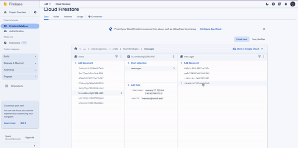

# Travelour

Travelour is an innovative travel planning application built with a modern tech stack, including Next.js, Tailwind CSS, and Firebase. At its core, Travelour offers a unique user experience by utilizing Rasa for intent classification and integrating OpenAI's powerful GPT models for processing unclassified intents. With NextAuth for authentication and Firebase for data management, Travelour provides a seamless and secure platform for all your travel planning needs.

## Features

- **Intuitive Travel Planning**: Plan your trips with ease, leveraging a user-friendly interface.
- **Rasa Intent Classification**: Advanced intent recognition to understand various travel queries and requirements.
- **OpenAI Integration**: Utilizes OpenAI API for processing complex, unclassified user intents, ensuring no query goes unanswered.
- **NextAuth Authentication**: Secure user authentication and session management.
- **Firebase Backend**: Robust backend support for storing and managing user data and preferences.
- **Responsive Design**: Crafted with Tailwind CSS, the application is fully responsive and provides a consistent experience across all devices.

## Getting Started

To get started with Travelour, follow these steps:

1. **Clone the Repository**
   ```bash
   git clone https://github.com/your-username/travelour.git
   cd travelour


2. **install dependencies**
    ```bash
    npm install

3. **Set up environment variables**
    ```bash
    NEXT_PUBLIC_FIREBASE_API_KEY=your_firebase_api_key
    NEXT_PUBLIC_OPENAI_API_KEY=your_openai_api_key

4. **Run dev server**
    ```bash
    npm run dev


# Video Demonstration



